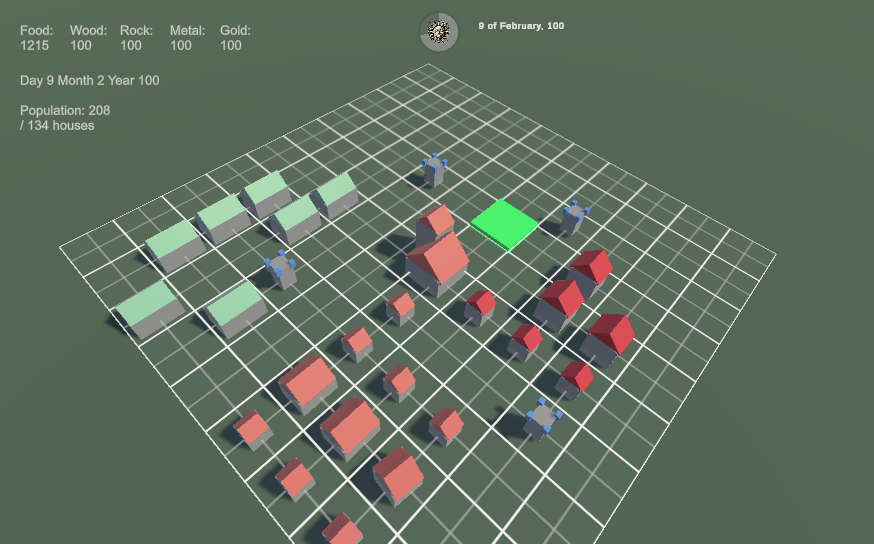

⚔️ **Kingdom Merge TD Preview**

    🎮 Playable Version: [itch.io](https://newbeedev.itch.io/kingdom-merge-td)

This repository contains an earlier development version of the project, showcasing my approach to:

    🏗️ Clean Architecture & DDD principles
    💼 Business logic design with clear separation of concerns
    🔧 Modular, testable systems built with Unity best practices

🎯 **About the Game**

Kingdom Merge TD is a casual merge-strategy simulator where you build and defend a medieval city. Merge buildings to upgrade them, manage resources, and protect your Town Hall from enemy raids!

✨ **Core Features**

    🔁 Merge Mechanics: Drag & drop 3 buildings of the same type/level to create powerful upgrades (3 → 1 progression, 5 → 2 etc)
    🏰 City Building: Place farms, houses, and defensive buildings on an isometric grid
    ⚔️ Tower Defense: Strategically position towers to fend off periodic enemy waves

Key principles applied:

    ✅ Dependency Inversion via VContainer for loose coupling
    ✅ Reactive data flow with UniRx for UI/game state synchronization
    ✅ Feature isolation — each gameplay system is a self-contained module
    ✅ View-Model separation — UI logic never touches domain logic directly
    

